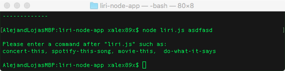
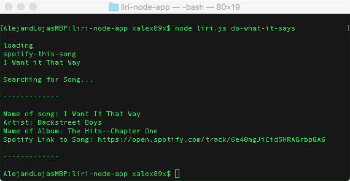
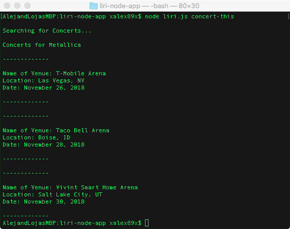
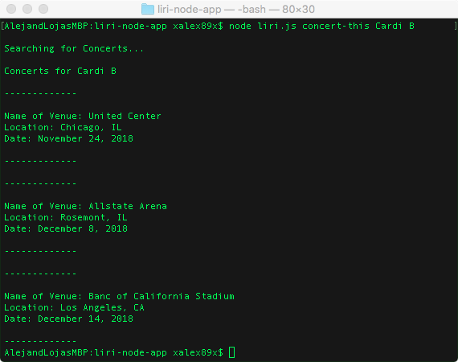
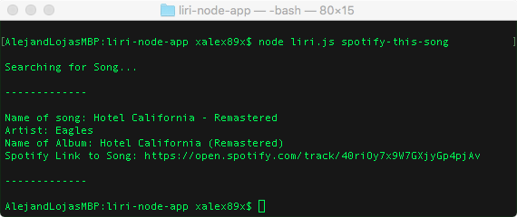
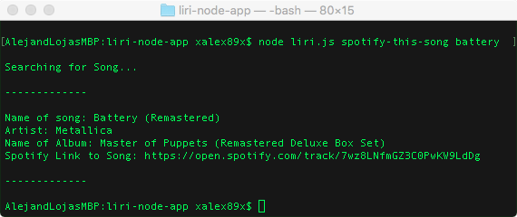
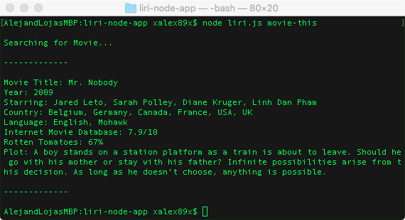
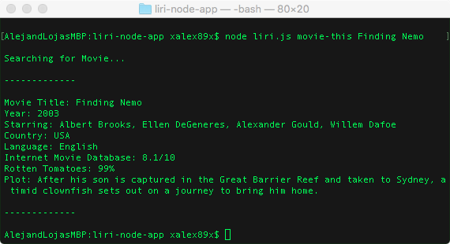

# LIRI Node App
#### LIRI - Is similar to Siri but for text based queries/responses.

This application uses *IMDB*, *Spotify*, and *Bands In Town* **APIs** to return information to the user.

**LIRI** works in the following way: 
1. First the use must install the proper libraries using:
```bash
$ npm install 
```

2. Start **LIRI** by typing:
```bash
$ node liri.js
```

3. You can give **LIRI** the following commands: 
<br>

   - `concert-this`
   - `spotify-this-song`
   - `movie-this`
   - `do-what-it-says`
 4. For each command (except `do-what-it-says`) enter a search term after the command to get a result.

 *If no search term is typed, then a default query will incur.*
<hr>

## See examples below:

**Entering nonsense into LIRI**


**Command: `do-what-it-says`**


<hr>

**Command: `concert-this` with default query**

**Command: `concert-this`**


<hr>

**Command: `spotify-this-song` with default query**

**Command: `spotify-this-song`**


<hr>

**Command: `movie-this` with default query**

**Command: `movie-this`**



